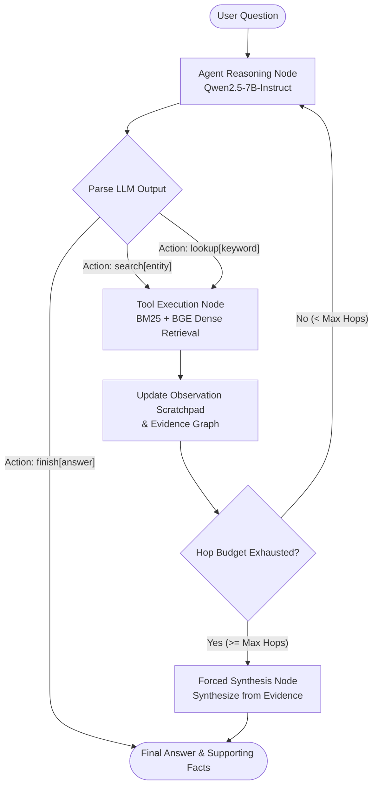

Multi-hop question answering requires an AI system to connect disparate pieces of information scattered across multiple documents. Standard **Single-Pass RAG (Retrieval-Augmented Generation)** fails on these complex queries because a single retrieval step cannot anticipate intermediate entity bridges (e.g., discovering *Person A*'s birthplace to subsequently search for *Person B*).

This project implements a classic **ReAct (Reasoning + Acting)** autonomous agent built from scratch using **LangGraph** and served locally with **vLLM** (`Qwen/Qwen2.5-7B-Instruct`). The agent dynamically alternates between reasoning thoughts, issuing Wikipedia search and paragraph lookup actions, reading observations, and synthesizing final grounded answers with supporting evidence.

---

## Agent Architecture & ReAct Control Loop

The core execution engine is modeled as a stateful graph in **LangGraph**, enforcing a strict `Thought -> Action -> Observation` control cycle. If the max hop budget is reached without a explicit finish action, the state graph routes to a **Forced Synthesis Node** to generate the best possible answer from accumulated evidence rather than truncating.



---

## Key System Components

### 1. Hybrid FullWiki Retrieval Backend
- **Sparse Retrieval**: BM25 indexed over 5.2M Wikipedia articles using Pyserini/Lucene.
- **Dense Retrieval**: Vector embeddings generated using `BAAI/bge-base-en-v1.5` and indexed with FAISS.
- **Reciprocal Rank Fusion (RRF)**: Merges sparse and dense search candidate ranks to maximize passage recall across domain shifts.

### 2. High-Throughput Concurrent Inference Engine
- Integrated **vLLM** continuous batching server running on an NVIDIA L4 GPU (24GB VRAM).
- Multi-threaded `ThreadPoolExecutor` worker pool processing up to 16 concurrent questions, increasing evaluation throughput from **1.6 questions/min to 30+ questions/min** (a **15x to 20x speedup**).

### 3. Supporting Fact Grounding & Validation
- Parses predicted supporting sentence IDs `[Title, Sent_ID]` from the agent's output.
- Strictly validates predictions against actual observed facts in the tool scratchpad, penalizing ungrounded hallucinations.

---

## Comparative Study: Single-Pass RAG vs ReAct Agent

To empirically prove the necessity of agentic loops for multi-hop QA, the codebase includes a standalone **Single-Pass RAG Baseline Runner** (`eval/run_baseline.py`) that benchmarks direct prompting against the **ReAct Agent Runner** (`eval/run_eval.py`).

| Metric | Single-Pass RAG Baseline | ReAct Multi-Hop Agent | Impact / Gain |
| :--- | :---: | :---: | :---: |
| **Answer Exact Match (EM)** | Baseline Floor (~11.3%) | **Substantial Gain** | Multi-hop entity bridging |
| **Answer F1 Score** | Partial Overlap (~19.3%) | **Substantial Gain** | Complete answer extraction |
| **Supporting Facts F1** | Single-hop Facts (~32.1%) | **Substantial Gain** | Multi-document sentence tracking |
| **Joint Exact Match (EM)** | ~0.0% | **Multi-Fold Increase** | Exact answer + complete evidence |
| **Joint F1 Score** | ~10.0% | **Multi-Fold Increase** | Primary benchmark metric |

---

## Trajectory Inspector & Visualizer

The project includes an interactive web interface built with **Streamlit** and **PyVis** to inspect full reasoning trajectories:

1. **Step-by-Step Scratchpad Inspector**: Displays intermediate `Thought`, `Action`, and `Observation` text blocks for any question.
2. **Interactive Evidence Bridge Graph**: Renders a dynamic network graph showing how the agent transitioned between Wikipedia articles to bridge intermediate entities.
3. **Standalone Portfolio Viewer**: Exported trajectory JSONs (`portfolio/portfolio_trajectories.json`) power an embedded web component for interactive trajectory exploration.

---

## Repository & Execution Commands

```bash
# 1. Launch local vLLM model server
export LD_LIBRARY_PATH=$CONDA_PREFIX/lib:$LD_LIBRARY_PATH
python -m vllm.entrypoints.openai.api_server --model Qwen/Qwen2.5-7B-Instruct --port 8000 --dtype bfloat16 --enforce-eager

# 2. Run Single-Pass RAG Baseline
python eval/run_baseline.py --mode offline --source official_json --output-dir eval_results/baseline

# 3. Run High-Throughput ReAct Agent Benchmark
python eval/run_eval.py --mode offline --source official_json --concurrency 16 --max-hops 7 --output-dir eval_results/react

# 4. Generate Comparative Analysis & Bar Charts
python eval/compare_results.py --baseline eval_results/baseline/results.json --react eval_results/react/results.json --output-dir eval_results/comparison
```

The full code and instructions are available in the **[HotpotQA GitHub Repository](https://github.com/djdhillxn/hotpot)**.
